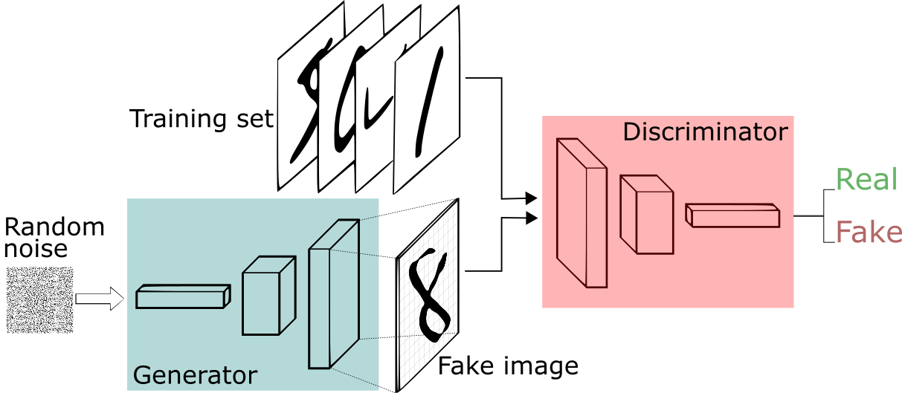
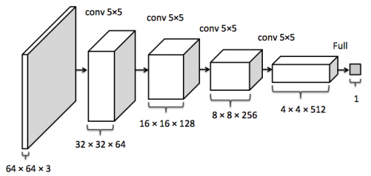

# General Adversarial Networks
The main component of this project.
General Adversarial Networks or GANs is neural network system which contains two components i.e., a discriminator net and a generator net.

### Discriminator
The discriminator net differentiates the images generated by the generator and the existing training set.
It classifies images as either true or false which is given by a single valued probability in the range 0-1.

### Generator
The generator net generates images from random noise vectors to fool the discriminator into believing that the images generated by it are part of the training set.

#### A simpler explanation...
An analogy for this system is that of a policeman and a theif. The theif attempts to counterfiet notes while the policeman determines whether the note is false or not.
This leads to a zero sum game where the policeman tries to improve his ability to find fake notes to thwart the theif while the thief improves his ability to produce counterfiet notes to fool the policeman.\
***Here the generator is the theif and the discriminator is the policeman.***

## Modules used
- Keras
- Tensorflow
- numpy
- scipy

## Deep Convolutional GAN
This version of the GAN follows the concept of using convolutional layers for discriminating and a mix of dense, upsampling and deconvolutional layers for the generator.
This was chosen as it gave much smoother results even with a smaller number of training epochs.\
The main drawback however, is that the resolution cannot go beyond 64x64 as any further than this requires more GPU memory than anything available in the world as of today.

### The discriminator

### The generator

[DCGAN implementation in keras](https://github.com/eriklindernoren/Keras-GAN/blob/master/dcgan/dcgan.py)

## Super Resolution GAN
This GAN helps increase the resolution of an image, in our case a 64x64 into a 256x256 image. Hence, the name Super Resolution.
It consists of a generator who takes the low resolution image as an input and returns the image in a higher resolution.\
The SRGAN resolved the drawback that existed with using the DCGAN, which was its low resolution image generation. Using this the images generated by the DCGAN were made more viable.

### The discriminator
The discriminator consists of discriminator modules each of which contains a convolutional layer on which Leaky ReLU and batch normalization functions are applied.
We also use a **pre-trained VGG19 net** which helps extract the features of the given high resolution images. These features are given to the discriminator net to process instead of the entire image.

### The generator
The generator consists of residual block modules and upsampling using deconvolution layers.

[SRGAN implementation in keras](https://github.com/eriklindernoren/Keras-GAN/tree/master/srgan)
